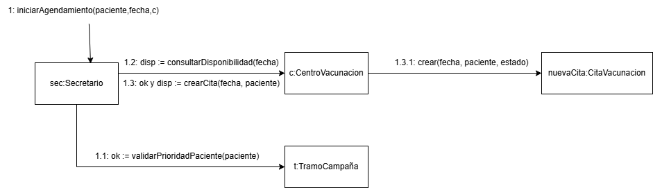
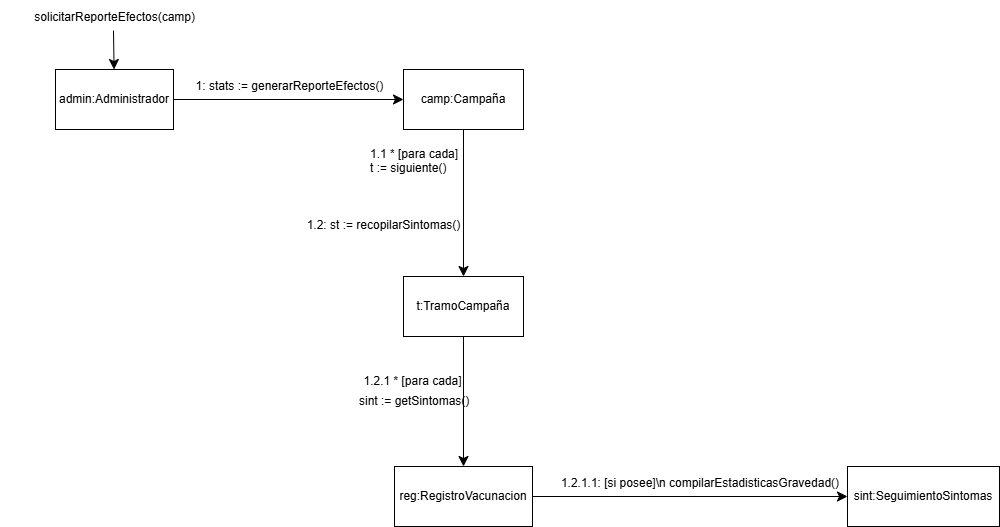
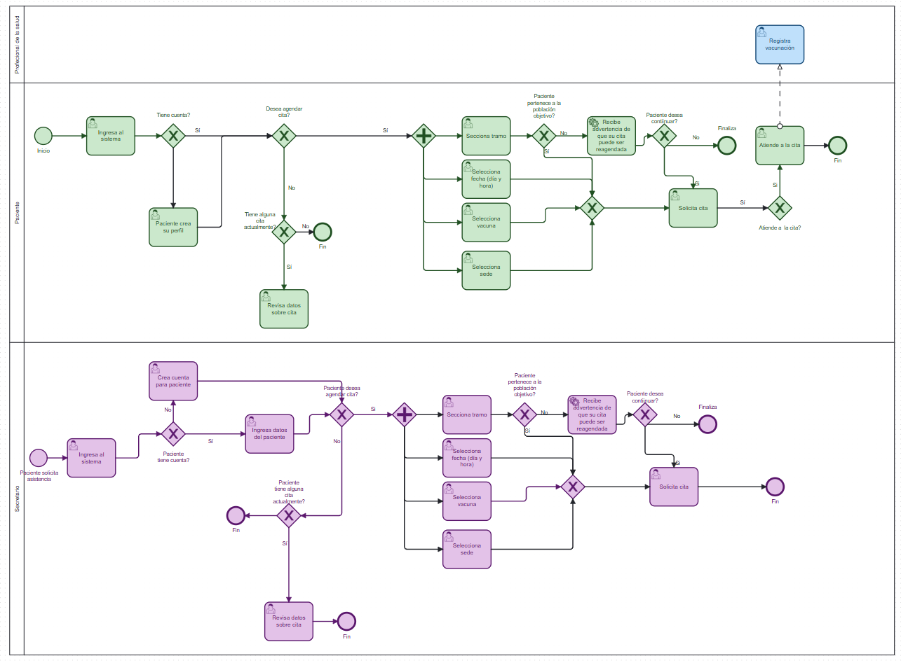
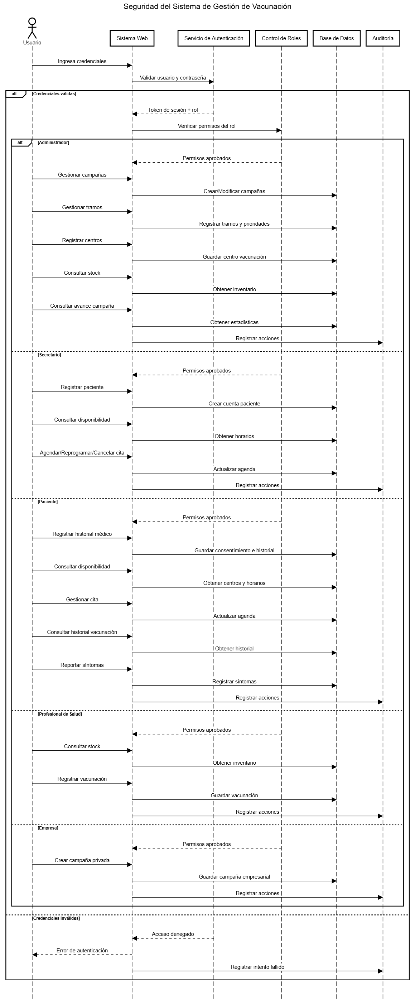

## Comando de ejecución
Estando en el root del código (\campana_vacunas) ejecutar el comando "flutter run". Una vez hecho esto igrese el número que corresponda a la opción de abrir en Chrome.

# Sistema de vacunas
## Diagrama de comunicación con creación de objetos (Agendamiento)

En este diagrama se modela la creación de una nueva cita médica aplicando los patrones 
GRASP correspondientes. En primer lugar, se utiliza el patrón Controlador, donde el objeto 
sec:Secretario actúa como el primer nodo que recibe y coordina la operación del sistema 
mediante el mensaje 1: iniciarAgendamiento(paciente,fecha,c). 
Para la validación de los datos, se aplica el patrón Experto en Información. Por un lado, se 
delega al objeto t:TramoCampaña la responsabilidad de ejecutar el mensaje 1.1: ok := 
validarPrioridadPaciente(paciente), ya que es la clase que posee la información sobre las 
reglas y poblaciones objetivo. Por otro lado, se delega al objeto c:CentroVacunacion la 
responsabilidad de ejecutar el mensaje 1.2: disp := consultarDisponibilidad(fecha), debido a 
que este objeto conoce su propio aforo, horarios y las citas que ya tiene agendadas. 
Finalmente, tras la validación mediante el mensaje 1.3: ok y disp := crearCita(fecha, 
paciente), se aplica el patrón Creador. El objeto c:CentroVacunacion asume la 
responsabilidad de instanciar el objeto nuevaCita:CitaVacunacion a través del mensaje 
1.3.1: crear(fecha, paciente, estado). Esta asignación se justifica porque un Centro de 
Vacunación es quien agrega, contiene y registra las citas de los pacientes en su recinto, 
cumpliendo con las directrices del patrón Creador. 

## Diagrama de comunicación de consulta (Reporte de efectos)

Este diagrama modela una consulta profunda sobre el dominio para generar estadísticas, 
sin crear nuevos objetos persistentes. Aquí se aplica de forma intensiva el patrón Experto 
en Información, distribuyendo la responsabilidad de generar el reporte en cascada sobre los 
expertos de cada nivel. El flujo comienza con el mensaje solicitarReporteEfectos(camp) 
hacia admin:Administrador, quien envía el mensaje 1: stats := generarReporteEfectos() al 
objeto camp:Campaña. La campaña itera con 1.1 * [para cada] t := siguiente() y delega la 
tarea enviando 1.2: st := recopilarSintomas() al objeto t:TramoCampaña. A su vez, el tramo 
delega enviando 1.2.1 * [para cada] sint := getSintomas() al objeto reg:RegistroVacunacion, 
el cual termina enviando 1.2.1.1: [si posee] compilarEstadisticasGravedad() al objeto 
sint:SeguimientoSintomas. Cada clase procesa exclusivamente la información que posee 
lógicamente. 
Esta estructura evidencia el patrón de Bajo Acoplamiento. Ni el Administrador ni la 
Campaña conocen la existencia de la clase SeguimientoSintomas. La comunicación respeta 
la jerarquía estricta, lo que garantiza que futuros cambios en la estructura de los síntomas 
no afectarán directamente a la Campaña ni al Administrador. 
Adicionalmente, se hace visible el patrón de Alta Cohesión. En lugar de tener una clase 
centralizada calculando todas las matemáticas del sistema, la lógica se encuentra altamente 
distribuida. El objeto sint:SeguimientoSintomas se encarga de manera exclusiva de la 
operación 1.2.1.1: [si posee] compilarEstadisticasGravedad(), manteniendo sus 
responsabilidades enfocadas, cohesivas y fáciles de mantener. 

## UML general 

## Diagrama de clases

### Correspondecia-mensaje método en Agendamiento:

El mensaje 1.1: validarPrioridadPaciente(paciente) corresponde al método validarPrioridadPaciente(paciente: Paciente) en la clase TramoCampaña.

El mensaje 1.2: consultarDisponibilidad(fecha) corresponde al método consultarDisponibilidad(fecha: DateTime) en la clase CentroVacunacion.

El mensaje 1.3.1: crear(fecha, paciente, estado) corresponde al constructor o método de fábrica de la clase CitaVacunacion que se llama desde CentroVacunación.

### Correspondecia-mensaje método en Reporte de efectos:

El mensaje 1: generarReporteEfectos() del flujo de consulta corresponde al método generarReporteEfectos() en la clase Campaña.

El mensaje 1.2: recopilarSintomas() corresponde al método recopilarSintomas() en la clase TramoCampaña.

El mensaje 1.2.1: getSintomas() corresponde al método getSintomas() en la clase RegistroVacunacion.

El mensaje 1.2.1.1: compilarEstadisticasGravedad() corresponde al método compilarEstadisticasGravedad() en la clase SeguimientoSintomas.

### Navegabilidad en Agendamiento

Secretario -> CitaVacunacion: El secretario gestiona e instancia citas, por lo que conoce a la cita, pero la cita no necesita conocer qué secretario específico la creó en su lógica de dominio.

CentroVacunacion -> CitaVacunacion: El centro debe poder navegar hacia sus citas agendadas para iterar sobre ellas y resolver el mensaje consultarDisponibilidad().

### Navegabilidad en Reporte de efectos

Administrador -> Campaña: El administrador inicia la consulta, por lo que requiere navegabilidad hacia la Campaña para invocar generarReporteEfectos().

Campaña -> TramoCampaña -> RegistroVacunacion -> SeguimientoSintomas: Se define una navegabilidad unidireccional descendente (composición y agregación) que soporta el paso de mensajes en cascada para la recopilación de datos, asegurando un bajo acoplamiento al evitar dependencias cíclicas hacia arriba.

## Justificación Patrones

### Patrón Creacional: Builder (Constructor)

Problema que resuelve: Logra mantener el codigo limpio y legible. A traves de absorber la responsabilidad de estructurar, validar y unir datos antes de la creacion del objeto. Esto provoca que las clases internas que procesan la información o los servicios de la aplicación no tengan que manipular texto ni ordenar listas manualmente, dejando que el código del negocio sea mucho más directo, limpio y fácil de mantener.

Alternativa descartada: Constructor Telescópico o Métodos en la Entidad. Se descartó sobrecargar la clase HistorialMedico con manejo de listas mutables temporales para no violar el Principio de Responsabilidad Única (SRP). La entidad debe ser inmutable y limpia.

Ubicación en el dominio: Capa de Dominio. Funciona como una fábrica utilitaria pura de negocio. No depende de ninguna tecnología, base de datos o framework de interfaz.

Pertinencia al flujo: Actúa en el flujo de Captura de Datos por Pasos. Ideal para formularios de interfaz donde el usuario añade alergias o vacunas dinámicamente. El Builder retiene el estado mutable y, solo al final del flujo, el método build() entrega un objeto del dominio 100% inmutable y formateado.

### Patrón de Comportamiento: Observer (Observador)

Problema que resuelve: Logra mantener el código limpio y libre de enredos al evitar que la clase de la cita tenga que encargarse de enviar correos, alertas o actualizar otras pantallas cuando cambia su estado. Al absorber esta responsabilidad, provoca que el flujo principal de la cita no se entere de cómo reacciona el resto del sistema, manteniendo el código ordenado.

Alternativa descartada: Invocación Directa. Se descartó escribir líneas como notificacionManager.enviarCorreo() o auditoria.registrar() directamente dentro del setter del estado. Esto habría amarrado la cita a esos servicios específicos, rompiendo el Principio de Responsabilidad Única (SRP) y obligándote a modificar esta clase cada vez que quisieras añadir una nueva alerta.

Ubicación en el dominio: Capa de Dominio. La entidad CitaVacunacion define la regla de negocio (avisar cuando cambia el estado) y la interfaz IObservadorCita vive ahí mismo, asegurando que la aplicación sea independiente de la tecnología de notificaciones.

Pertinencia al flujo: Actúa en el flujo de Post-Procesamiento y Efectos Secundarios. En el momento exacto en que un administrativo o el sistema cambia el estado de la cita, el setter intercepta el cambio y dispara las alertas en segundo plano inmediatamente, sin frenar ni interferir con la acción principal del usuario.

### Patrón Creacional: Singleton 

Problema que resuelve: Evita que se creen múltiples "administradores de notificaciones" en la aplicación. Si cada pantalla o servicio creara su propio NotificacionManager, la lista registroNotificaciones se perdería o se duplicaría en memoria. El Singleton asegura que todo el sistema use la misma y única central de notificaciones.

Alternativa descartada: Variables Globales o Instanciación Manual. Se descartó crear la instancia a mano en cada archivo o usar una variable global suelta, ya que cualquiera podría sobrescribirla por error, rompiendo el control del sistema.

Ubicación en el dominio: Capa de Aplicación / Servicios. Actúa como un coordinador o servicio que conecta el evento del dominio con las acciones del mundo exterior.

Pertinencia al flujo: Actúa en el flujo como un Punto Central de Despacho. No importa en qué parte del viaje del paciente se dispare una alerta , este único objeto centraliza la orden y la procesa.

### Patrón Estructural: Decorator 

Problema que resuelve: Permite crear una estructura flexible para añadirle responsabilidades adicionales a un objeto en tiempo de ejecución sin alterar su código original. Al absorber la delegación del mensaje, provoca que los decoradores específicos solo tengan que preocuparse por su propia tarea, manteniendo el código ordenado.

Alternativa descartada: Herencia clásica por cada canal. Se descartó obligar a que cada tipo de notificación herede directamente de una clase madre rígida. Esto habría impedido combinar canales dinámicamente , forzándo a crear una clase distinta para cada combinación posible en el sistema.

Ubicación en el dominio: Capa de Infraestructura / Servicios. Define el contrato técnico y el mecanismo de herencia para los componentes encargados de interactuar con los servicios externos de mensajería.

Pertinencia al flujo: Actúa en la fase de Preparación y Composición. En el flujo de salida, sirve como el esqueleto que permite recibir el mensaje de texto plano y sostener la cadena de envolturas necesarias justo antes de que el comando final .enviarMensaje() dispare todos los envíos en cascada.

### Patrón Estructural: Facade 

Problema que resuelve: Logra mantener el código limpio y legible al absorber la responsabilidad de interactuar con múltiples componentes, buscar en bases de datos y validar inventarios antes de completar el registro. Esto provoca que las clases internas que manejan la interfaz de usuario o los flujos principales de la aplicación no tengan que coordinar todo este desorden de objetos ni conocer los detalles de inventarios y estados, dejando que el código del sistema sea mucho más directo, limpio y fácil de mantener.

Alternativa descartada: Coordinación dispersa. Se descartó que la pantalla de la aplicación llamara uno por uno a la base de datos, restara el stock del inventario, cambiara el estado de la cita y llamara al manager de notificaciones. Esto habría duplicado el código en varias partes y haría que cualquier cambio en las reglas de vacunación obligara a modificar múltiples archivos.

Ubicación en el dominio: Capa de Aplicación / Servicios. Actúa como un orquestador de alto nivel que une distintas entidades del dominio (Paciente, Cita, Centro) para ejecutar un caso de uso específico del negocio.

Pertinencia al flujo: Actúa en el flujo de Ejecución y Cierre. En el momento exacto en que el profesional de salud presiona el botón "Registrar Vacunación", la Fachada toma el control total del flujo, realiza todas las operaciones lógicas tras bambalinas en un solo viaje y devuelve un resultado definitivo (Éxito o Error) para que el sistema continúe su curso.

## Diseño BPMN

## Esquema de seguridad

## Link al video explicativo
https://youtu.be/hhvTzEg9E5g